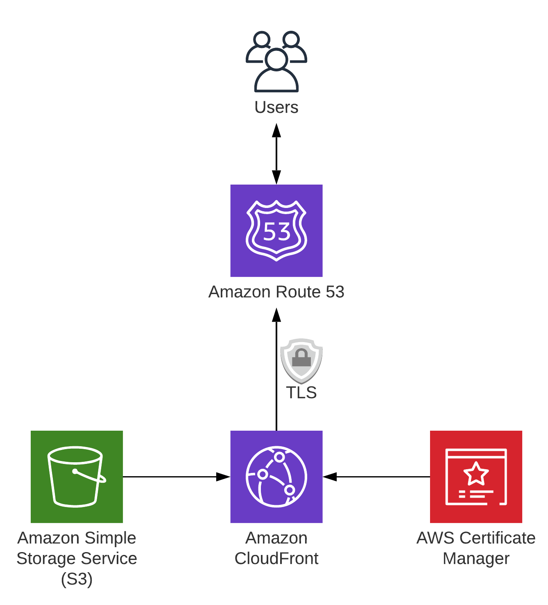

# 운영 배포

## 사전 가정

1. cfn 템플릿 파일 저장용 버킷 생성
1. TSL/SSL 인증서를 위한(CloudFront) ACM(us-east-1) 인증서 생성
1. 루트 도메인이 외부 도메인 관리 기관에 있을 경우 NS 레코드 등록
1. 루트 도메인에 NS 레코드 등록 시 실시간 대응이 안될 경우 AWS Hosted Zone을 미리 생성하여 NS 레코드 복사 후 리소스 삭제(재 생성 시 동일한 NS 유지)
1. Github 개발자 토큰 발행 후 AWS Secret Manager에 등록

## 상세 절차

1. AWS Console > S3 > CloudFormation 작업용 버킷을 생성합니다.(리전 확인)
1. main.yml 파일을 제외하고 모든 yml 파일을 1번에서 생성한 버킷에 업로드합니다.
1. AWS Console > CloudFormation > us-east-1 리전으로 변경하고 dns.yml 템플릿을 이용해 ACM 인증서를 위한 스택을 생성합니다.
1. 생성된 ACM 인증서의 ARN 값을 복사합니다.
1. AWS Console > CloudFormation 에서 Stack 생성을 누르고 main.yml 파일을 선택합니다.
1. DNS Stack 생성 중에 Route53에서 생성된 Hoste Zone의 NS 서버 리스트를 복사합니다.
1. 도메인 관리 설정에서 서브 도메인을 위한 NS 레코드를 만들고 값에 복사한 NS 서버 리스트를 입력합니다.
1. 인증서 검증(DNS)이 정상적으로 확인되었는지 체크합니다.

## 웹호스팅 스택

## 웹 CI/CD 파이프라인 스택

## CloudFormation 작업 가이드

- [Level up CloudFormation with VS Code](https://towardsthecloud.com/level-up-cloudformation-vscode)
- [AWS CloudFormation Workshop](https://catalog.workshops.aws/cfn101/en-US)
- [공식 도움말](https://docs.aws.amazon.com/ko_kr/AWSCloudFormation/latest/UserGuide/Welcome.html)

## Troubleshooting

### Serverless Site Hosting
- [Restricting access to an Amazon S3 origin](https://docs.amazonaws.cn/en_us/AmazonCloudFront/latest/DeveloperGuide/private-content-restricting-access-to-s3.html)
- [Automate Building a Unique Domain Hosting Environment with AWS CloudFormation](https://dev.to/aws-builders/automate-building-a-unique-domain-hosting-environment-with-aws-cloudformation-4ehl)
- [Retrieve StackName from nested Stacks in AWS CloudFormation](https://www.itonaut.com/2020/01/10/retrieve-stackname-from-nested-stacks-in-aws-cloudformation/)

### CI/CD for site hosting
- S3 에 static file을 배포하는 방법이 두 가지가 있음
    1. Bulild 과정에서 S3 버킷과 Sync하는 방법: 기존 배포 과정에서 Build 과정이 필요한 경우 쉽고 빠르게 전달 가능
    1. CodePipeline에서 직접 S3 버킷을 타겟으로 배포하는 방법(압축 전송 및 해제): Build 과정이 없는 경우 별도 배포 단계 진행
- [CodeBuild로 배포하기](https://mckinnel.me/deploy-a-static-blog-quickly-on-aws.html)
- [CodeDeploy로 배포하기](https://dev.to/giyoungjr/cloudformation-template-to-create-a-cicd-pipeline-for-a-react-application-hosted-in-an-s3-bucket-39g2)